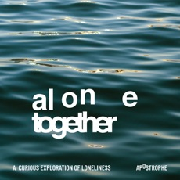

import { YouTube } from '@astro-community/astro-embed-youtube';
import { Image } from "astro:assets";

import FancyBlockquote from "/src/components/typography/FancyBlockquote.astro";

<FancyBlockquote cite="Suzza Silver" name="mdi:comment-quote">
We have to face the things which make us feel the most uncomfortable. They also have the potential to bring us our greatest loves.
</FancyBlockquote>

Suzza Silver is the writer with the mathematical muse. On Beauty of Mathematics, they take
readers on a journey from math anxiety to math confidence. Aiding them to confront
their feelings and show how they too can fall in love with math.

## A Torrid Love Affair With Math Begins

As a child, Suzza struggled with mathematics.
They had to repeat fourth-grade math because they could not do multiplication. 

That extra year made them. By using a simple substitution code they assigned numbers to letters. This transformed
their equations. When working with letters, they were able to read multiplication problems as sentences. For the 
first time, they understood what that little multiplication symbol represented. 

This allowed Suzza to catch up to their peers in their fifth-grade year. For the full story.
read ["A Writer's Illicit Love Affair With Mathematics."](https://beautyofmathematics.com/a-writers-illicit-love-affair-with-mathematics/)

## Available for Interviews

Suzza Silver is knowledgeable on the following topics.

- Math Anxiety
- Math Communications
- Marginalization in STEM

In addition, they have a made living creating content. Primarily as a freelance writer for the past decade.

They have worked as the Director of Community for a new TSR. A tabletop RPG publisher that is now known as [Solorian Games](https://solariangames.com/). Working closely with Jayson Elliot.

Suzza spent five years at [The Social Element](https://thesocialelement.agency/) agency.  Working as a Community manager and moderator. Some of their  clients were Keurig Dr Pepper and Diageo.

They now focus their time on writing about mathematics for the public. Hoping
to break the cycle of math trauma through education and sharing their story. 

Suzza Silver is featured in interviews with [Forbes](https://www.forbes.com/sites/hessiejones/2023/08/25/empowering-confidence-overcoming-math-anxiety-in-the-age-of-artificial-intelligence/?sh=303025ce7e2c), [Alone Together Podcast](https://podcasts.apple.com/us/podcast/one-is-the-loneliest-number-or-is-it/id1547298340?i=1000524569087), and [Fancy Comma](https://www.youtube.com/watch?v=kFMbugMoTsg).

{/* 

 */}